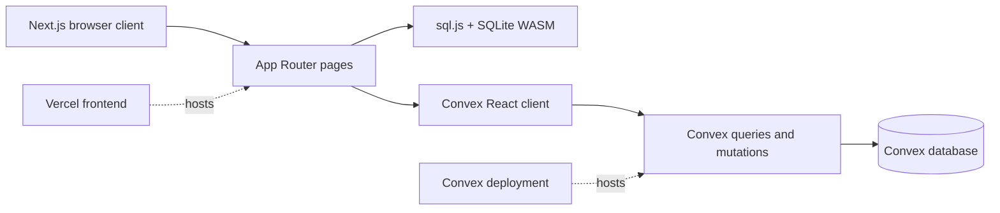
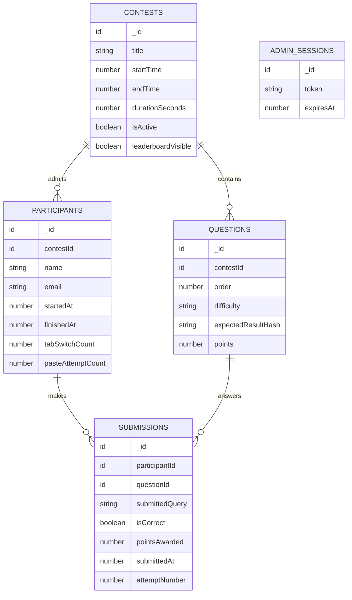

# Queries War End-to-End Technical Audit

**Audit date:** 2026-08-27  
**Repository:** `quries_war`  
**Scope:** Next.js application, Convex functions and schema, browser SQL execution, build/release controls, and the user journeys represented by the current source tree.

## Executive Summary

Queries War is a Next.js App Router frontend backed by Convex. SQL is executed locally in the browser with `sql.js`; Convex stores contests, questions, participants, submissions, and admin sessions and exposes reactive queries to the UI.

The project currently builds successfully and TypeScript passes. It is not production-ready as a competitive contest system because the trust boundary is wrong: participant identity, correctness, and awarded points are supplied by the browser and accepted by public Convex mutations. The most important risks are:

1. **Critical: unauthenticated participant impersonation and score forgery.** `participants.get` and `submissions.submit` accept a client-supplied participant ID. A caller can read another participant's record and submit a correct answer, arbitrary query, or finalization for that participant. `isCorrect` and `pointsAwarded` are also client inputs.
2. **High: administrator credentials are hardcoded and displayed in the login UI.** The password is present in `convex/admin.ts` and the page displays the default credentials.
3. **High: correctness does not enforce row order.** `lib/sqlRunner.ts` sorts result rows before hashing. Questions requiring `ORDER BY` can therefore be solved with the right rows in the wrong order.
4. **High: contest lifecycle is not enforced consistently.** Registration starts the clock immediately, including before the scheduled start. Submission checks only the contest end time, not `isActive` or `startTime`. A client timeout only redirects and does not finalize the participant server-side.
5. **Medium: public leaderboard visibility is not enforced.** The page and query expose the leaderboard regardless of `leaderboardVisible`.

There is no GitHub Actions workflow, automated test script, coverage gate, Convex deployment job, or documented environment template. The current quality gate is local-only: lint, TypeScript, and Next production build.

## Current Architecture

### Runtime boundaries

- **Frontend:** `app/` contains static and client components. `app/contest/page.tsx` loads question seed SQL and expected hashes through Convex, executes arbitrary contestant SQL locally, hashes the result, and submits the verdict.
- **Backend:** `convex/` contains public queries/mutations plus one internal seed and activation mutation. Convex reactive queries provide live updates; there is no separate API route layer.
- **Local execution:** `lib/sqlRunner.ts` creates a fresh in-memory SQLite database per run, executes seed SQL followed by user SQL, and applies a 3-second timeout check.
- **State persistence:** participant and admin identifiers are stored in `localStorage`. There is no external authentication provider, `convex/auth.config.ts`, signed cookie, or server-side session middleware.
- **Generated code:** `convex/_generated/` is generated Convex output and should not be hand-edited.

## Build and CI Audit

### What currently runs

The package scripts are:

| Script | Current behavior | Result on audit date |
|---|---|---|
| `pnpm dev` | Starts Next development server | Not exercised |
| `pnpm build` | Runs `next build` with Turbopack | Passed; all current routes compiled and prerendered |
| `pnpm start` | Starts the production Next server | Not exercised |
| `pnpm lint` | Runs ESLint | Passed with 5 warnings, 0 errors |
| `pnpm typecheck` | Runs root `tsc --noEmit` | Passed |
| `pnpm format` | Writes Prettier formatting | Mutating command; not a gate |

The repository contains no `.github/workflows` directory, no `test` or `test:ci` script, and no tracked `.env.example`. `.env.local` exists locally and is not tracked. The build output confirms these routes: `/`, `/register`, `/contest`, `/contest/leaderboard`, `/contest/submitted`, `/admin`, and `/admin/login`.

### Recommended CI pipeline

CI should run on pull requests and pushes to the protected branch:

1. Install Node using the repository-supported version and run `pnpm install --frozen-lockfile`.
2. Run `pnpm lint` and fail on warnings after removing the unused `Geist` import and generated-file warning policy.
3. Run `pnpm typecheck`.
4. Run Convex's current typecheck/code generation validation for the deployed Convex version.
5. Run unit tests for result hashing, lifecycle rules, authorization, score calculation, and duplicate/attempt behavior.
6. Run `pnpm build` with non-secret build-time configuration.
7. Deploy Convex only from an explicit protected-branch or release job, never from pull requests. Deploy the Next frontend separately after the backend job succeeds.
8. Run a smoke test against a disposable preview deployment: register, submit a correct and incorrect answer, verify live leaderboard behavior, and verify an unauthenticated/wrong-participant request is rejected.

Production secrets should be supplied by the CI/Vercel/Convex secret stores. The admin credential must not be committed or rendered to users.

## User Flows: Shipped Behavior

### Contestant flow

1. `/register` calls `contests.getForRegistration` and shows the currently active contest.
2. The form calls `participants.create` with name, email, and contest ID. The mutation trims the values and immediately sets `startedAt` to the server timestamp.
3. The returned participant ID is stored in `localStorage`; the browser redirects to `/contest`.
4. `/contest` loads the participant by that ID, loads the latest active contest and up to 15 questions, and samples server time once to estimate clock offset.
5. `runQuery` executes the question's seed SQL and the editor's SQL entirely in the browser.
6. Submit recomputes the browser result, compares the browser-computed hash with the question's expected hash, then sends `isCorrect`, `pointsAwarded`, query text, and IDs to `submissions.submit`.
7. The final question sets `finishedAt`; otherwise the next question is selected. The timer reaching zero only redirects to `/contest/submitted`.
8. `/contest/leaderboard` subscribes to `leaderboard.get` and updates reactively.

### Administrator flow

1. `/admin/login` sends an admin ID and password to `admin.login`.
2. The mutation compares against constants, creates a random token in `adminSessions`, and returns the token to the browser.
3. The token is stored in `localStorage`; admin queries pass it as a normal Convex argument.
4. `/admin` checks the token, loads contests and aggregate stats, and subscribes to live scores.
5. Contest creation and activation call token-gated mutations. The leaderboard checkbox only changes local React state; it is not saved until another contest update is sent.
6. Sign-out deletes the session row and clears local storage.

### Missing or roadmap-only flows

The roadmap describes waiting/countdown, anti-cheat event logging, per-participant submission drill-down, force-end controls, and a fuller admin control surface. Those are not present in the current route tree or implementation. In particular, there is no `visibilitychange`, paste/copy, context-menu, or devtools detection implementation.

## Backend API Inventory

| Function | Visibility | Purpose | Main concern |
|---|---|---|---|
| `contests.getActive` | Public query | Return active contest and questions | Returns question grading hashes; selection is only latest active row |
| `contests.getForRegistration` | Public query | Return registration contest | Does not establish a server-side registration window |
| `contests.serverTime` | Public query | Return `Date.now()` | Useful as a hint, not a complete authoritative timer protocol |
| `contests.adminList` | Public query, token-gated | List contests | Token is supplied by client; no identity provider |
| `contests.adminCreate` | Public mutation, token-gated | Create contest and copy questions | Template copy is implicit and may choose an unrelated contest |
| `contests.adminUpdate` | Public mutation, token-gated | Update contest | Does not validate session expiry after lookup consistently through a helper; visibility update is UI-dependent |
| `participants.create` | Public mutation | Insert participant | No duplicate policy, rate limit, email verification, or authentication |
| `participants.get` | Public query | Fetch participant | Any caller with an ID receives name and email |
| `submissions.submit` | Public mutation | Store submission and optionally finish | Trusts participant ID, correctness, and points from caller |
| `leaderboard.get` | Public query | Compute ranking | Ignores `leaderboardVisible`; bounded reads and repeated per-participant queries |
| `admin.login/check/logout` | Public mutation/query | Session lifecycle | Hardcoded password and bearer token in local storage/arguments |
| `admin.dashboard/liveScores` | Public query, token-gated | Admin metrics | N+1 reads and hard limits of 50/1,000 records |
| `seed.seed` / `contests.activate` | Internal mutation | Seed and activate data | Appropriate internal visibility; operational invocation is not documented in CI |

## Schema and Data Model Audit

### Tables and relationships

### Strengths

- Foreign keys use typed Convex IDs rather than arbitrary strings.
- Child records are separate tables, avoiding unbounded submission arrays in participant documents.
- The main access paths have indexes: contest title/active state, questions by contest, participants by contest, and submissions by participant/question.
- Server timestamps are used when registrations and submissions are written.
- Question difficulty is a discriminated literal union.

### Schema gaps

- There is no unique constraint or index for participant email within a contest, so repeat registrations are unrestricted.
- There is no explicit contest status enum. `isActive` combines scheduling, publication, and operational state, which allows inconsistent transitions.
- Questions have no unique `(contestId, order)` enforcement; duplicate or missing order values are possible.
- Submissions have no uniqueness or idempotency key. Retries can create duplicate attempts, and `attemptNumber` is calculated by scanning up to 1,000 prior rows.
- `adminSessions.token` is stored as a bearer secret in plaintext. Store a hash of the token and expire/delete sessions through a scheduled cleanup.
- `tabSwitchCount`, `pasteAttemptCount`, and `isDisqualified` exist but have no mutation or workflow using them.
- Stored query text may contain personal data or maliciously large input. Add input length limits and a retention policy.
- `expectedResultHash` is adequate as a grading key only if the canonicalization contract is deliberate and tested. It currently removes row-order significance.

## Findings and Remediation

### Critical: participant impersonation and score forgery

`participants.get` takes any participant ID and returns the record. `submissions.submit` takes any participant ID, question ID, correctness flag, and points. The backend checks only that the question belongs to the participant's contest. A malicious browser can therefore submit points for another participant, finalize them, or read their email. The Convex auth guidelines explicitly require deriving identity server-side rather than accepting a user identifier for authorization.

**Fix:** add real authentication and bind a participant to the provider's stable `tokenIdentifier`, or issue a server-created, scoped participant session. In every participant query/mutation, derive the caller identity server-side and verify ownership. Never accept `isCorrect` or `pointsAwarded` as authoritative inputs.

### High: grading is client-authoritative

The browser runs the SQL, computes the hash, and sends the verdict. Even with participant authorization fixed, a caller can invoke the public mutation directly and claim correctness. The server cannot reproduce the browser's database state from the current schema because the question seed SQL is stored as executable text and no trusted grading action exists.

**Fix:** move grading to a constrained trusted service/action, or treat the browser result only as provisional and verify it server-side. Keep the expected answer material private from contestants. Define and test whether result comparison is ordered, typed, and sensitive to column names.

### High: hardcoded admin credential

`convex/admin.ts` defines `ADMIN_PASSWORD = "QueriesWar@2026"`, and `/admin/login` displays it as the default credential. This is a credential disclosure, not merely a development default.

**Fix:** rotate the exposed credential immediately, load a hash or identity-provider configuration from Convex environment variables, add rate limiting and audit logging, and remove the credential hint from the UI. Prefer provider-backed admin identity with server-side role checks.

### High: lifecycle and timeout enforcement

Registration is allowed by the mutation unless the contest is inactive and already past its end, while the public registration query returns only active contests. Registration sets `startedAt` immediately, without checking `startTime`. Submission checks `endTime` but not `startTime` or `isActive`. The browser redirects at its locally estimated deadline without writing `finishedAt`, so server state can remain in progress.

**Fix:** centralize a server-side `contestState()` function. Enforce `now >= startTime`, `now < min(startTime + duration, endTime)`, active status, and disqualification in every write. Add an internal timeout/finalization mutation or finalize lazily on the next server request. Make final submission idempotent.

### High: ordered answers are not graded as ordered

`normalizedRows()` sorts rows before hashing. This makes the hash invariant to row order, contradicting prompts that require exact sorting and the seed authoring notes that describe expected rows in a precise order.

**Fix:** preserve result row order in the canonical representation, and add fixtures where two queries return identical rows in different orders. Also define null, numeric, text, duplicate-row, column-name, and floating-point comparison rules.

### Medium: leaderboard privacy flag is ineffective

`leaderboardVisible` is returned by contest queries but `leaderboard.get` never checks it. The public route always renders the table. The admin checkbox only updates local state until another update is submitted and does not itself persist a change.

**Fix:** enforce visibility in the backend query and return an intentional empty/locked response when hidden. Persist the toggle through an authenticated mutation and use the stored value as the only source of truth.

### Medium: scale and consistency limits

Leaderboard and admin queries read participants and then issue one submissions query per participant. They cap participants, contests, and submissions with `take(50)`, `take(100)`, or `take(1_000)`. This produces N+1 reads, silently incomplete rankings after limits, and increasingly expensive reactive recomputation.

**Fix:** add contest-scoped aggregate score documents updated transactionally on submission, or use a deliberate materialized leaderboard. Paginate admin lists and submission history. Add indexes matching all high-volume access paths and load-test at expected contest size.

### Medium: no abuse controls or input limits

Public registration and submission mutations have no rate limit. Names, emails, query text, and numeric values have no meaningful length/range limits. Admin login has no lockout or rate limit.

**Fix:** validate bounded input sizes and finite nonnegative points server-side, add rate limiting, and add retention rules for query text and sessions.

### Low: operational/documentation drift

The roadmap describes Next.js 15, but the package uses Next.js 16.2.6. The roadmap says admin credentials should be environment-backed, while code uses a constant. The README contains only a short product description and does not document local Convex setup, environment variables, seed invocation, deployment order, or rollback.

**Fix:** make the roadmap a clearly labeled product plan, document the current versions and deployment runbook, and add `.env.example` with names only, never values.

## Recommended Delivery Order

1. Rotate the exposed admin credential and remove it from source/UI.
2. Add participant/admin authentication and backend ownership checks.
3. Make grading authoritative and fix ordered result canonicalization.
4. Centralize lifecycle checks and server-side timeout finalization.
5. Enforce/persist leaderboard visibility and add idempotency.
6. Add focused tests and a pull-request CI workflow.
7. Replace N+1 leaderboard reads with aggregates and add pagination/load tests.
8. Add anti-cheat telemetry only as evidence; do not treat browser controls as security boundaries.

## Verification Baseline

On 2026-08-27:

- `pnpm typecheck`: passed.
- `pnpm build`: passed; current routes compiled successfully.
- `pnpm lint`: passed with 5 warnings and 0 errors.
- Automated tests: no test script or test suite found.
- CI workflows: none found.
- Convex production deployment: not performed as part of this audit.

Passing build checks demonstrate that the application compiles. They do not demonstrate authorization, contest timing, grading integrity, or production deployment correctness; those require the tests and preview smoke flow described above.